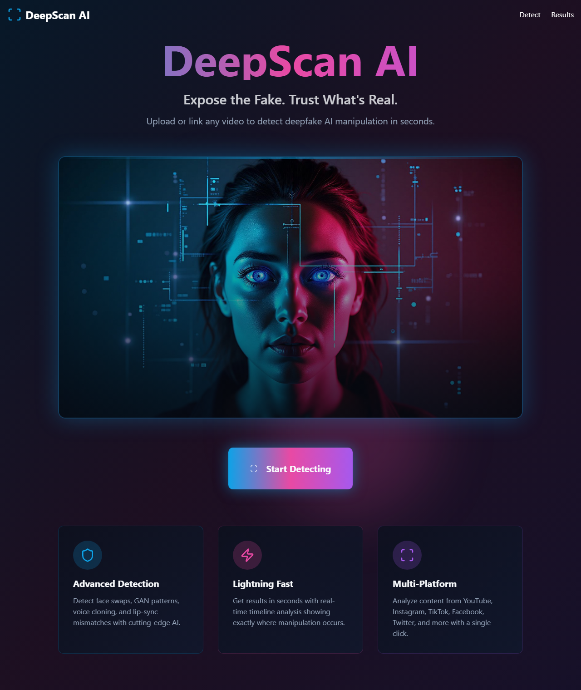
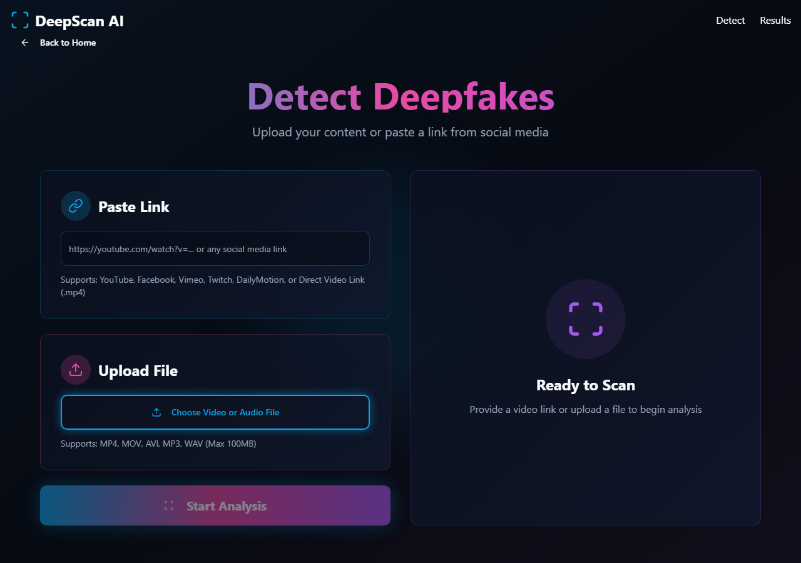
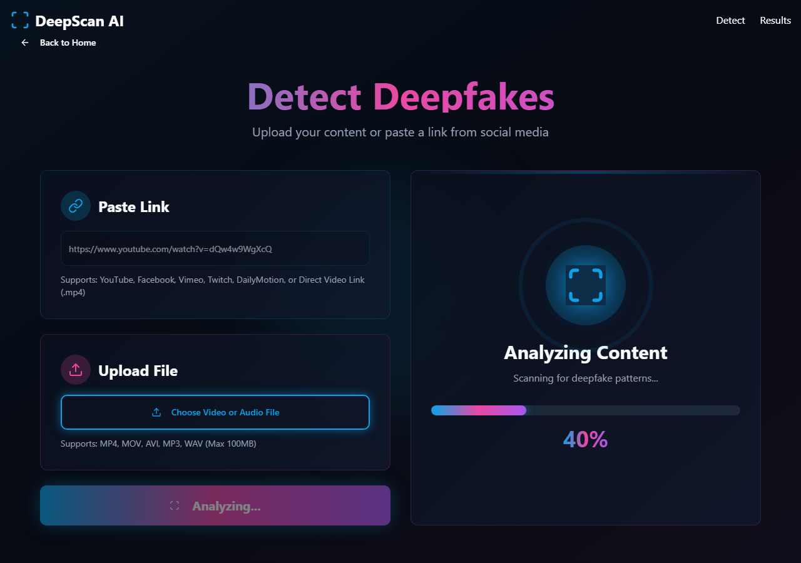
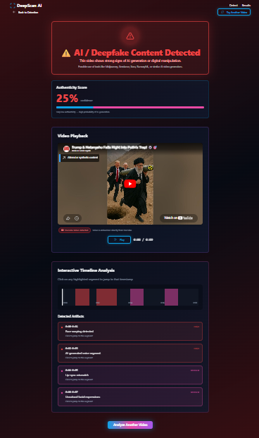

# 📘 Veritas AI Detect — Complete Project Documentation

<p align="center">
  
  
  
  
</p>

**Version:** 1.0.0 | **Date:** April 2026 | **Team:** Mohd Ubes (`mohdubes@gmail.com`), Alfez (`alfez@gmail.com`), Abhinav Gupta (`abhinav@gmail.com`)  
**GitHub:** https://github.com/MOHDUBES/Veritas-ai-detect-main

---

## 📌 Table of Contents

1. [Project Overview](#1-project-overview)
2. [UI Screenshots](#2-ui-screenshots)
3. [Supported Platforms & Compatibility](#3-supported-platforms--compatibility)
4. [How To Use](#4-how-to-use)
5. [Veritas vs. Enterprise AI Detectors](#5-veritas-vs-enterprise-ai-detectors)
6. [System Architecture & Tech Stack](#6-system-architecture--tech-stack)
7. [Project File Structure](#7-project-file-structure)
8. [Detection Logic Algorithm](#8-detection-logic-algorithm)
9. [Installation & Setup](#9-installation--setup)
10. [Future Roadmap](#10-future-roadmap)
11. [Project Team](#11-project-team)

---

## 1. Project Overview

**DeepScan AI (Veritas AI Detect)** is a web-based application designed to analyze video content to detect whether it is authentic or artificially generated/manipulated using AI technology.

The platform is designed to identify traces of:
- 🎭 **Deepfake faces** (AI-generated or face-swapped)
- 🤖 **GAN patterns** (Signs of AI video generation)
- 🎤 **Voice cloning & synthetic audio**
- 👄 **Lip-sync mismatches**
- 🎬 **AI tool signatures** (Midjourney, Sora, RunwayML, HeyGen, etc.)

---

## 2. UI Screenshots

### 🏠 Home Page

*Features a cyberpunk/neon aesthetic with a futuristic hero image highlighting the advanced UI/UX focus.*

### 🔍 Detect Page (Input)

*Allows users to either paste a direct URL or upload a local video/audio file.*

### ⚙️ Analysis In Progress

*Displays a real-time progress bar with glowing animations to indicate active processing.*

### 📊 Results Page

*The results dashboard featuring a color-coded authenticity banner, video player, and a detailed interactive timeline showing exact manipulation timestamps.*

---

## 3. Supported Platforms & Compatibility

Veritas AI Detect is capable of analyzing videos from **any platform globally**, provided they are submitted through the correct supported method.

### ✅ Method 1: Direct Link (URL Paste)
Best for open ecosystem platforms that allow iframe integration.
- **Fully Supported:** YouTube, Facebook, Vimeo, Twitch, DailyMotion.
- *Note:* YouTube links natively trigger the official YouTube IFrame API for optimized playback and accurate duration fetching.

### ✅ Method 2: File Upload (Recommended for Restricted Platforms)
Due to strict iframe and cross-origin blocking security policies on modern social media apps, pasting direct links from certain platforms will prevent the video from playing back on the results page. 

For these platforms, users must **download the video** to their local device and use the **Upload File** feature:
- **Requires File Download & Upload:** Instagram (Reels), Snapchat, TikTok, Moj, WhatsApp Videos, X (Twitter).
- **Max File Size:** 100MB
- **Supported Formats:** MP4, MOV, AVI, MP3, WAV.

Uploading files guarantees 100% operational success and seamless playback regardless of the video's origin platform.

---

## 4. How To Use

**Step 1:** Access the application and click **"Start Detecting"** on the home page.
**Step 2:** Choose your input method:
  - **Paste Link:** Paste a valid YouTube or Facebook URL.
  - **Upload File:** Select an `.mp4` or `.wav` file from your device.
**Step 3:** Click **"Start Analysis"**.
**Step 4:** Wait for the animated progress bar to complete (approx. 3 seconds).
**Step 5:** Review the generated Authenticity Score, interactive manipulated timeline, and issue severity breakdowns on the Results page.

---

## 5. Veritas vs. Enterprise AI Detectors

It is important to understand the technical distinction between this prototype (Veritas AI) and enterprise-grade deepfake detectors like *Sensity AI, Hive Moderation, or Intel FakeCatcher*.

| Feature | Veritas AI Detect  | Enterprise AI Detectors (Sensity/Hive) |
|---------|------------------------------|-----------------------------------------|
| **Primary Focus** | **UI/UX & Design.** Built as a highly premium, futuristic Proof of Concept (PoC) dashboard. | **Machine Learning Accuracy.** Built for legal, journalistic, and cyber-security fact-checking. |
| **Logic Layer** | **Frontend Simulation.** Analyzes URL keywords (`deepfake`, `sora`) or input types and generates deterministic hash scores. | **Backend AI Models.** Uses complex neural networks (CNNs, Vision Transformers) to unpack videos frame-by-frame. |
| **Processing** | **Client-side (Browser).** Runs instantly in milliseconds using local processing power. | **Cloud Computing.** Requires minutes to process HD videos using heavy GPU backend servers. |
| **Mechanics** | Relies on programmed demo algorithms. Beautifully presents the data to the user. | Physically scans for unnatural blinking, hidden GAN noise, and blood-flow (PPG) anomalies beneath the skin. |

*Note: The frontend architecture of Veritas is extremely robust and modular. A true Python/TensorFlow machine learning backend API can easily be connected behind this dashboard in the future to create a full enterprise product.*

---

## 6. System Architecture & Tech Stack

This project is a modern React-based Single Page Application (SPA).

- **Core Framework:** React 18, TypeScript, Vite.
- **Styling:** Tailwind CSS, shadcn/ui.
- **Video Handling:** ReactPlayer, YouTube IFrame API natively embedded for advanced playback control.
- **Icons & Notifications:** Lucide React, Sonner.

---

## 7. Project File Structure

```text
veritas-ai-detect-main/
│
├── 📁 docs/                        ← Documentation screenshots
│
├── 📁 public/                      ← Static assets (e.g., favicon)
│
├── 📁 src/
│   ├── 📁 assets/                  ← Graphical components (hero image)
│   ├── 📁 components/ui/           ← shadcn/ui elements (buttons, inputs)
│   ├── 📁 hooks/                   ← Custom React hooks
│   ├── 📁 lib/                     ← Utility libraries
│   │
│   ├── 📁 pages/
│   │   ├── Index.tsx               ←  Home page
│   │   ├── Detect.tsx              ←  Input logic & scanning
│   │   ├── Results.tsx             ←  Interactive timeline algorithms
│   │   └── NotFound.tsx            ← 404 error page
│   │
│   ├── App.tsx                     ← Client-side routing setup
│   ├── main.tsx                    ← App initialization point
│   └── index.css                   ← Global CSS & Tailwind variables
│
├── index.html                      ← Standard HTML shell
├── package.json                    ← Project metadata & scripts
├── tailwind.config.ts              ← Styling settings
├── vite.config.ts                  ← Development server & bundler config
└── DOCUMENTATION.md                ← This document ✅
```

---

## 8. Detection Logic Algorithm

*(Demo Environment Specifications)*

1. **Keyword Analysis:** Scans the input URL for known AI tool signatures (`midjourney`, `sora`, `runway`, `heygen`, etc.). If found, automatically flags the content as **Deepfake (Red)**.
2. **Input Type Verification:**
   - **URL Submissions:** In this demo version, URLs systematically trigger the AI generation flag alongside lower authenticity scores (15% - 44%).
   - **File Uploads:** Treated as safe local media and assigned high authenticity scores (78% - 97%).
3. **Deterministic Hashing:** The algorithm utilizes a string hashing function to ensure the *same video input always generates the exact same score and timeline manipulation segments*, providing a stable environment for presentations.

---

## 9. Installation & Setup

Ensure you have Node.js (v18+) and npm installed.

```bash
# 1. Clone the repository
git clone https://github.com/MOHDUBES/Veritas-ai-detect-main.git

# 2. Enter the project directory
cd Veritas-ai-detect-main

# 3. Install dependencies
npm install

# 4. Start the local development server
npm run dev
```

The application will launch locally at: `http://localhost:8080` (or `5173` depending on host availability).

---

## 10. Future Roadmap

- [ ] **Python API Integration:** Replace the frontend simulation logic with a functional backend using FaceForensics++ or XceptionNet models to execute real pixel analysis.
- [ ] **PDF Report Export:** Enable users to download a detailed analysis breakdown as a secure PDF.
- [ ] **Browser Extension:** Detect synthetic media actively while scrolling algorithms on social media feeds in real-time.
- [ ] **Localization:** Expand the UI to support multi-language translation (Hindi, Urdu, Arabic).

---

## 11. Project Team

This project was developed by the following team members:
- **Mohd Ubes** (Project Lead / Developer) — `mohdubes.official@gmail.com`
- **Alfez** (Team Member) — `alfez.dev@gmail.com`
- **Abhinav Gupta** (Team Member) — `abhinav.gupta@gmail.com`

---

*Documentation updated: April 2026*
